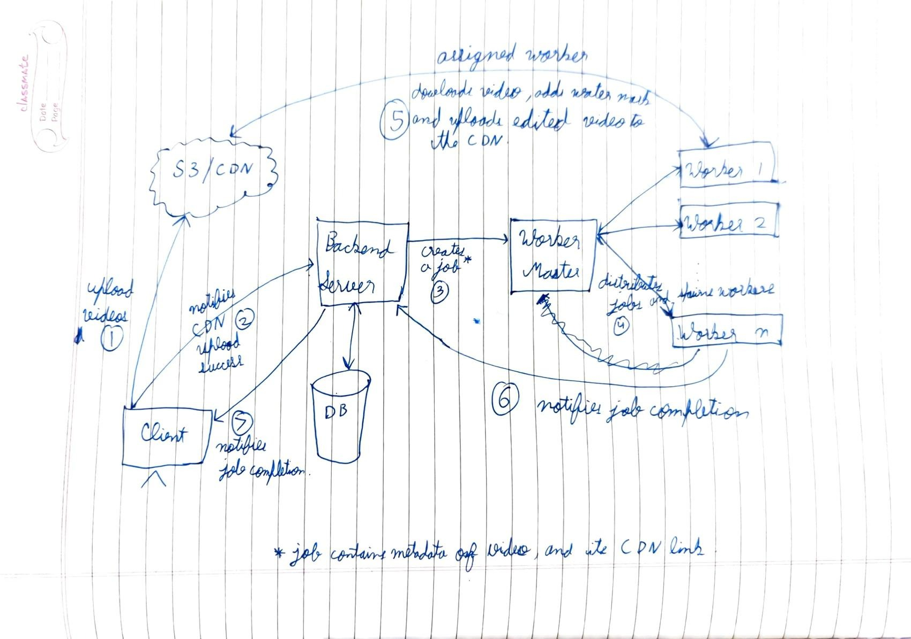

# Alternate Architecture Design

I ask to please read the [Readme.md](./Readme.md) file before this one to understand the implemented architecture of the project, because I make comparisons to that of the architecture proposed in this document.

The proposed architecture focuses on high availability of the entire system.

## Integrating a CDN

The first optimisation comes in the form of using a CDN (via something like S3) to store media (image/video) files. Currently this project store the uploaded media in a folder right next to it's source code. This means that that the same machine that is interacts with the database and serving HTTP requests is also responsible for reading large files over a network.

If enough clients push upload at the same time, the service WILL crash. To avoid this unfortunate scenario, we outsource the heavy lifting of handling uploads to a CDN.

The clients directly uploads media to the CDN and just shares the URL of the uploaded media with the main server.

Moreover, S3 storage is much cheaper than storage on an EC2 (or similar) VM instance.

## On-Demand Worker De/Spawning

A dedicated service may be built that assigns jobs to worker threads on different machines, that is also capable of provisioning and de-provisioning machines as-per some measure of aggregate load on all workers.

For example, we may define an ideal average CPU consumption (say 75%) over all workers. If the current average CPU consumption is well below the ideal consumption, then the service may de-provision some worker machines to save on costs. On the other hand if the current consumption is way above the ideal, then the service should provision more machines and instantiate new workers on them.

## Diagram

Please find below (or [open separately](./design_diagram.jpeg)) a very rough diagram of what a system with the above changes would look like.

